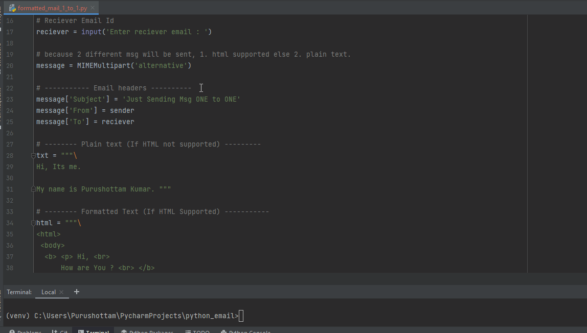

# Send Formatted Text mail or bulk mail via Python

Python has a rich library of different functions. sending email is also one of them. I have shown 3 different ways to send mail. 
> One to One customized &amp; formatted mail (If HTML supported) & Plain text (In Case HTML Not Supported) <br>
> Send mail to many using CSV file. <br>
> Send to gmail via yagmail in just 16 lines of code.

## Installation
<h4>Check whether pip is installed or not</h4>

```sh
pip -V 
```

<h4>If pip is not installed then install it by using following command on CMD<h4>

```sh
python get-pip.py
```

<h3> Step-1 : Download the zip file of this project.</h3>
<h3> Step-2 : Open your terminal (command prompt in windows) </h3>
<h3> Step-3 : Go to directory where you extracted the zip file </h3>

<h4> Now run following command to download all required package for this tool.</h4>

```sh
pip install -r requirement.txt  
```

## Usage

### One to One Formatted Mail.

```sh
 python formatted_mail_1_to_1.py 
```

### Send to All by importing mails from csv file.

```sh
 python mail_to_all_from_csv.py 
```

### Send to gmail via yagmail.

```sh
 python send_via_yagmail.py
```
 
## How It Works
 



